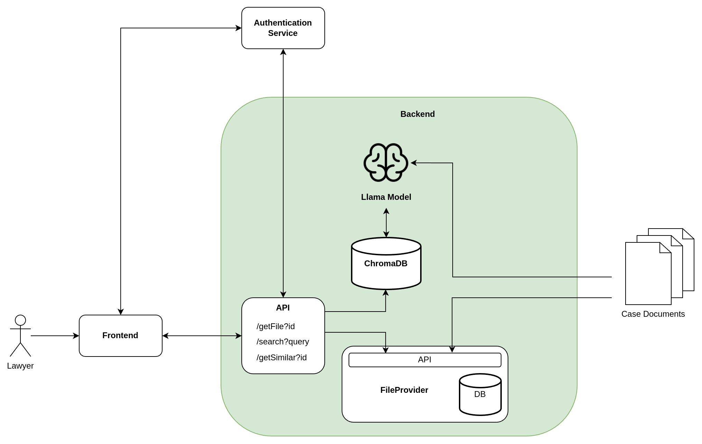

# Comparrotor Concept
Our application is designed to assist legal professionals in efficiently finding and comparing similar court documents. By providing a user-friendly interface, users can explore the similarities between documents with ease, allowing for a more streamlined comparison process.

## Technical Solution
### Metainformation Comparison
In the legal domain, court documents often contain crucial metadata such as dates, parties involved, case numbers, and jurisdictions. We leverage this metainformation to facilitate search and comparison functionalities. Here's how:

- **Metadata Normalization**: Each document is parsed to extract its essential metadata. To ensure consistency, we standardize this information and store it in our own structured database.
- **Searchable Metadata**: Once normalized, these metadata attributes become searchable. Users can filter and compare documents based on key fields such as date ranges, parties involved, or case types. This provides a powerful tool for narrowing down relevant documents before diving into the content itself.

### Semantic Comparison
Beyond simple metadata comparison, our application offers advanced semantic search capabilities that allow for more nuanced document exploration.

- **Document-Level Comparison**: Users can select a specific document and request similar documents based on the overall content. This semantic analysis is performed by generating embeddings—mathematical representations of the document's content—that capture the essence of the text.

- **Paragraph-Level Comparison**: For deeper analysis, users can zoom into a specific paragraph within a document and request similar paragraphs from other documents. This functionality is especially useful when only certain sections of a case are of interest.

- **Embedding Calculation**: The core of our semantic comparison lies in embeddings, which are generated for every paragraph in a document. These embeddings represent the semantic meaning of the text, allowing for comparison based on content rather than keywords alone.

- **Cosine Similarity**: When a user initiates a search or comparison, we compute the cosine distance between the embeddings of the selected document or paragraph and other documents in the database. This ensures that the results are the most semantically similar to the input.

- **Search Embeddings**: Similarly, when users perform a search query, the search terms themselves are embedded. We then compare these search embeddings with document embeddings to return relevant results based on meaning, not just exact word matches.

### Architecture

## Tool Selection
To deliver these capabilities, we rely on cutting-edge, open-source technologies.

- **ChromaDB**: At the heart of our system is ChromaDB, an open-source vector database (licensed under Apache 2.0) that is optimized for managing and searching embeddings. It allows us to efficiently store and query the semantic representations of our documents.

- **Embedding Models**: For generating the embeddings that drive our semantic comparisons, we plan to utilize open-source models such as LLaMA3 (insert license here). These models are powerful enough to capture the subtleties of legal language and provide high-quality, semantically relevant results.

This combination of metadata-driven search and deep semantic analysis enables legal professionals to find and compare court documents with unprecedented precision and ease.